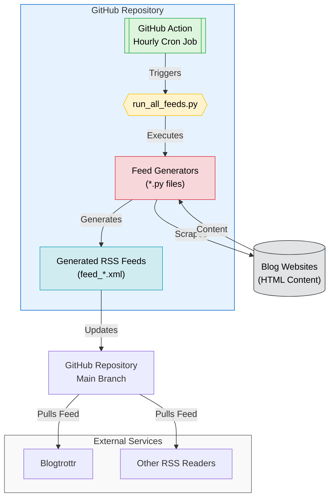

# RSS Feed Generator <!-- omit in toc -->

> [!NOTE]
> This is a fork of [Olshansk/rss-feeds](https://github.com/Olshansk/rss-feeds) by [Daniel Olshansky](https://github.com/Olshansk).
> Read his original blog post: [No RSS Feed? No Problem. Using Claude to automate RSS feeds.](https://olshansky.substack.com/p/no-rss-feed-no-problem-using-claude)

## tl;dr Available RSS Feeds <!-- omit in toc -->

| Blog                                                                                      | Feed                                                                                                                                                 |
| ----------------------------------------------------------------------------------------- | ---------------------------------------------------------------------------------------------------------------------------------------------------- |
| [Anthropic News](https://www.anthropic.com/news)                                          | [feed_anthropic_news.xml](https://raw.githubusercontent.com/vandijks/rss-feeds/main/feeds/feed_anthropic_news.xml)                                   |
| [Anthropic Engineering](https://www.anthropic.com/engineering)                            | [feed_anthropic_engineering.xml](https://raw.githubusercontent.com/vandijks/rss-feeds/main/feeds/feed_anthropic_engineering.xml)                     |
| [Anthropic Research](https://www.anthropic.com/research)                                  | [feed_anthropic_research.xml](https://raw.githubusercontent.com/vandijks/rss-feeds/main/feeds/feed_anthropic_research.xml)                           |
| [Anthropic Frontier Red Team](https://red.anthropic.com/)                                 | [feed_anthropic_red.xml](https://raw.githubusercontent.com/vandijks/rss-feeds/main/feeds/feed_anthropic_red.xml)                                     |
| [Claude Code Changelog](https://github.com/anthropics/claude-code/blob/main/CHANGELOG.md) | [feed_anthropic_changelog_claude_code.xml](https://raw.githubusercontent.com/vandijks/rss-feeds/main/feeds/feed_anthropic_changelog_claude_code.xml) |
| [OpenAI Research](https://openai.com/news/research/)                                      | [feed_openai_research.xml](https://raw.githubusercontent.com/vandijks/rss-feeds/main/feeds/feed_openai_research.xml)                                 |
| [Ollama Blog](https://ollama.com/blog)                                                    | [feed_ollama.xml](https://raw.githubusercontent.com/vandijks/rss-feeds/main/feeds/feed_ollama.xml)                                                   |
| [Paul Graham's Articles](https://www.paulgraham.com/articles.html)                        | [feed_paulgraham.xml](https://raw.githubusercontent.com/vandijks/rss-feeds/main/feeds/feed_paulgraham.xml)                                           |
| [Surge AI Blog](https://www.surgehq.ai/blog)                                              | [feed_blogsurgeai.xml](https://raw.githubusercontent.com/vandijks/rss-feeds/main/feeds/feed_blogsurgeai.xml)                                         |
| [xAI News](https://x.ai/news)                                                             | [feed_xainews.xml](https://raw.githubusercontent.com/vandijks/rss-feeds/main/feeds/feed_xainews.xml)                                                 |
| [Chander Ramesh's Writing](https://chanderramesh.com/writing)                             | [feed_chanderramesh.xml](https://raw.githubusercontent.com/vandijks/rss-feeds/main/feeds/feed_chanderramesh.xml)                                     |
| [Thinking Machines Lab](https://thinkingmachines.ai/blog/)                                | [feed_thinkingmachines.xml](https://raw.githubusercontent.com/vandijks/rss-feeds/main/feeds/feed_thinkingmachines.xml)                               |
| [Hamel Husain's Blog](https://hamel.dev/)                                                 | [feed_hamel.xml](https://raw.githubusercontent.com/vandijks/rss-feeds/main/feeds/feed_hamel.xml)                                                     |
| [Cursor Blog](https://cursor.com/blog)                                                    | [feed_cursor.xml](https://raw.githubusercontent.com/vandijks/rss-feeds/main/feeds/feed_cursor.xml)                                                   |
| [Windsurf Blog](https://windsurf.com/blog)                                                | [feed_windsurf_blog.xml](https://raw.githubusercontent.com/vandijks/rss-feeds/main/feeds/feed_windsurf_blog.xml)                                     |
| [Windsurf Changelog](https://windsurf.com/changelog)                                      | [feed_windsurf_changelog.xml](https://raw.githubusercontent.com/vandijks/rss-feeds/main/feeds/feed_windsurf_changelog.xml)                           |
| [Windsurf Next Changelog](https://windsurf.com/changelog/windsurf-next)                   | [feed_windsurf_next_changelog.xml](https://raw.githubusercontent.com/vandijks/rss-feeds/main/feeds/feed_windsurf_next_changelog.xml)                 |
| [Patrick Collison's Blog](https://patrickcollison.com/culture)                            | _planned_                                                                                                                                            |
| [Supabase Blog](https://supabase.com/blog)                                                | _planned_                                                                                                                                            |
| [David Crawshaw](https://crawshaw.io/)                                                    | _planned_                                                                                                                                            |
| [Engineering.fyi](https://engineering.fyi/)                                               | _planned_                                                                                                                                            |

### What is this?

You know that blog you like that doesn't have an RSS feed and might never will?

🙌 **You can use this repo to create a RSS feed for it!** 🙌

## Table of Contents <!-- omit in toc -->

- [Quick Start](#quick-start)
  - [Subscribe to a Feed](#subscribe-to-a-feed)
  - [Request a new Feed](#request-a-new-feed)
- [Create a new a Feed](#create-a-new-a-feed)
- [Star History](#star-history)
- [Ideas](#ideas)
- [How It Works](#how-it-works)
  - [For Developers 👀 only](#for-developers--only)

## Quick Start

### Subscribe to a Feed

- Go to the [feeds directory](./feeds).
- Find the feed you want to subscribe to.
- Use the **raw** link for your RSS reader. Example:

  ```text
    https://raw.githubusercontent.com/vandijks/rss-feeds/main/feeds/feed_ollama.xml
  ```

- Use your RSS reader of choice to subscribe to the feed (e.g., [Blogtrottr](https://blogtrottr.com/)).

### Request a new Feed

Want a new feed? [Open a GitHub issue](https://github.com/vandijks/rss-feeds/issues/new) with the blog URL.

> Consider supporting the original author [Daniel Olshansky](https://github.com/Olshansk) by [buying him a coffee](https://buymeacoffee.com/olshansky).

## Create a new a Feed

1. Download the HTML of the blog you want to create a feed for.
2. Open Claude Code CLI
3. Tell claude to:

```bash
Use @cmd_rss_feed_generator.md to convert @<html_file>.html to a RSS feed for <blog_url>.
```

## Star History

[](https://star-history.com/#Olshansk/rss-feeds&Date)

## Ideas

- **X RSS Feed**: Going to `x.com/{USER}/index.xml` should give an RSS feed of the user's tweets.

## How It Works



### For Developers 👀 only

- Open source and community-driven 🙌
- Simple Python + GitHub Actions 🐍
- AI tooling for easy contributions 🤖
- Learn and contribute together 🧑‍🎓
- Streamlines the use of Claude, Claude Projects, and Claude Sync

## Credits

This project is a fork of [Olshansk/rss-feeds](https://github.com/Olshansk/rss-feeds), created by [Daniel Olshansky](https://github.com/Olshansk).

Licensed under the [MIT License](./LICENSE) - the original copyright and license terms are preserved as required.
