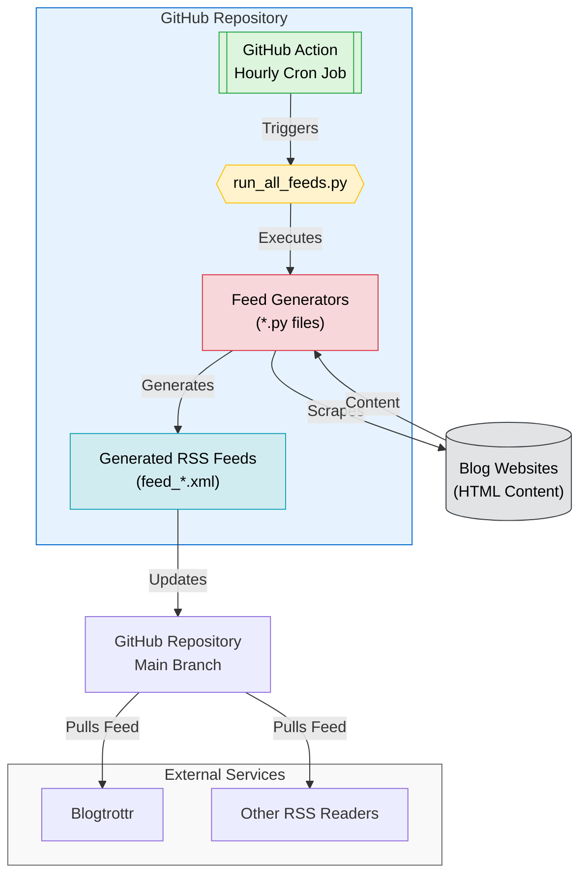

# RSS Feed Generator <!-- omit in toc -->

> [!NOTE]
> This is a fork of [Olshansk/rss-feeds](https://github.com/Olshansk/rss-feeds) by [Daniel Olshansky](https://github.com/Olshansk).
> Read his original blog post: [No RSS Feed? No Problem. Using Claude to automate RSS feeds.](https://olshansky.substack.com/p/no-rss-feed-no-problem-using-claude)

## tl;dr Available RSS Feeds <!-- omit in toc -->

These are sites I'm subscribed to but that don't offer RSS feeds. Now they do!

| Blog                                                                                  | Feed                                                                                                                                           | Notes                                                                                              |
| ------------------------------------------------------------------------------------- | ---------------------------------------------------------------------------------------------------------------------------------------------- | -------------------------------------------------------------------------------------------------- |
| [Noordhollands Dagblad - Alkmaar](https://www.noordhollandsdagblad.nl/regio/alkmaar/) | [feed_noordhollandsdagblad_alkmaar.xml](https://raw.githubusercontent.com/vandijks/rss-feeds/main/feeds/feed_noordhollandsdagblad_alkmaar.xml) | Local news from the Alkmaar region                                                                 |
| [Barron's](https://www.barrons.com/)                                                  | [feed_barrons.xml](https://raw.githubusercontent.com/vandijks/rss-feeds/main/feeds/feed_barrons.xml)                                           | Excludes: Commentary, Media, Video, Magazine, Retirement. Includes: Markets, Tech, Stock Picks... |

> **Note:** Original feeds from the upstream repo are archived in `feed_generators/archive/` and `feeds/archive/` for reference.

### What is this?

You know that blog you like that doesn't have an RSS feed and might never will?

🙌 **You can use this repo to create a RSS feed for it!** 🙌

## Table of Contents <!-- omit in toc -->

- [Quick Start](#quick-start)
  - [Subscribe to a Feed](#subscribe-to-a-feed)
- [Ideas](#ideas)
- [How It Works](#how-it-works)
  - [For Developers](#for-developers)

## Quick Start

### Subscribe to a Feed

- Go to the [feeds directory](./feeds).
- Find the feed you want to subscribe to.
- Use the **raw** link for your RSS reader. Example:

  ```text
    https://raw.githubusercontent.com/vandijks/rss-feeds/main/feeds/feed_noordhollandsdagblad_alkmaar.xml
  ```

- Use your RSS reader of choice to subscribe to the feed (e.g., [Blogtrottr](https://blogtrottr.com/)).

## Ideas

- **X RSS Feed**: Going to `x.com/{USER}/index.xml` should give an RSS feed of the user's tweets.

## How It Works



### For Developers

- Open source and community-driven 🙌
- Simple Python + GitHub Actions 🐍
- AI tooling for easy contributions 🤖
- Learn and contribute together 🧑‍🎓
- Streamlines the use of Claude, Claude Projects, and Claude Sync

## Credits

This project is a fork of [Olshansk/rss-feeds](https://github.com/Olshansk/rss-feeds), created by [Daniel Olshansky](https://github.com/Olshansk).

Licensed under the [MIT License](./LICENSE) - the original copyright and license terms are preserved as required.
